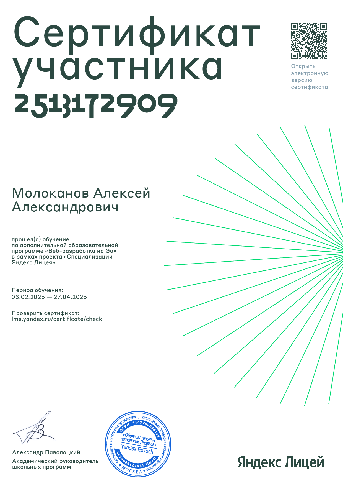

# Алексей — Backend разработчик (Go)

Backend разработчик с опытом разработки микросервисных систем на Go. Специализируюсь на конкурентном программировании, REST API и асинхронной обработке.

## 🎯 Ключевые навыки

**Основной стек:**
- Go (горутины, каналы, контекст, конкурентность)
- PostgreSQL, Redis
- Docker, Docker Compose
- REST API, Clean Architecture

**Паттерны и подходы:**
- Worker pool, Fan-in/Fan-out, Producer-Consumer
- Graceful shutdown, асинхронные операции
- Race detector, performance profiling
- git, GitHub, CI/CD

---

## 📦 Проекты

### [Health Checker API](https://github.com/Bobr-Lord/Health-Checker-API) ⭐
**Асинхронный HTTP сервис для конкурентной проверки доступности веб-ресурсов**

**Технологии:** Go, chi, sync.RWMutex, context, goroutines, channels  
**Ключевые компоненты:**
- Worker pool на буферизованных каналах
- In-memory task store с sync.RWMutex
- REST API с context-based отменой (DELETE)
- Graceful shutdown
- 100% покрытие тестами с `-race` детектором

---

### [Мессенджер на микросервисной архитектуре](https://github.com/Bobr-Lord/messenger)
**WebSocket мессенджер с Kafka, Redis и микросервисами**

**Технологии:** Go, Kafka, WebSocket, Redis, Docker, REST API  
**Особенности:**
- Асинхронная обработка через Kafka
- Real-time уведомления через WebSocket
- Кэширование сессий в Redis
- Микросервисная архитектура (Gateway, Auth, Message, Chat, User)

---

### [ToDo приложение](https://github.com/Bobr-Lord/todo_app)
**REST API с JWT авторизацией и PostgreSQL**

**Технологии:** Go, PostgreSQL, Docker, JWT, Clean Architecture  
**Особенности:**
- Clean Architecture (handler → service → repository)
- JWT авторизация
- Database миграции
- GitLab CI конфигурация

---

### [React Go Shop](https://github.com/Bobr-Lord/react-go-shop)
**E-commerce с React фронтенда и двумя Go микросервисами**

**Технологии:** React, Go (auth + shop сервисы), PostgreSQL, Docker, nginx, JWT  
**Особенности:**
- Два независимых Go сервиса (auth и shop)
- JWT для межсервисного взаимодействия
- nginx reverse proxy
- Docker Compose для полного стека

---

## 🏆 Сертификации

- **Яндекс.Практикум** — Сертификат по Go (горутины, каналы, микросервисная архитектура)

---

## 📬 Контакты

- GitHub: [@Bobr-Lord](https://github.com/Bobr-Lord)
- Telegram: [@bobr_lord](https://t.me/bobr_lord)
- Email: alexeymol27@gmail.com
